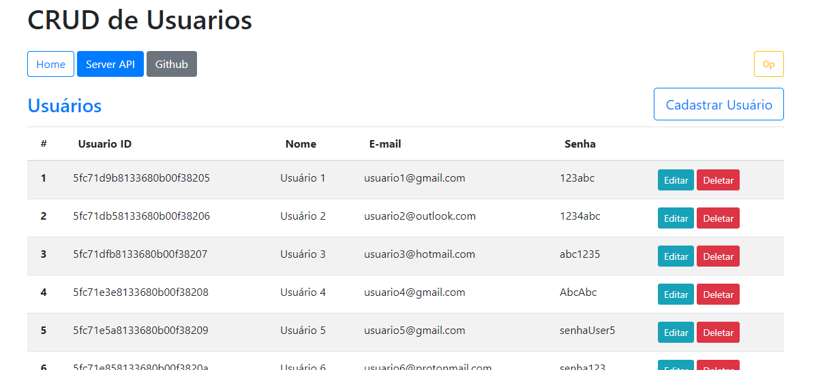
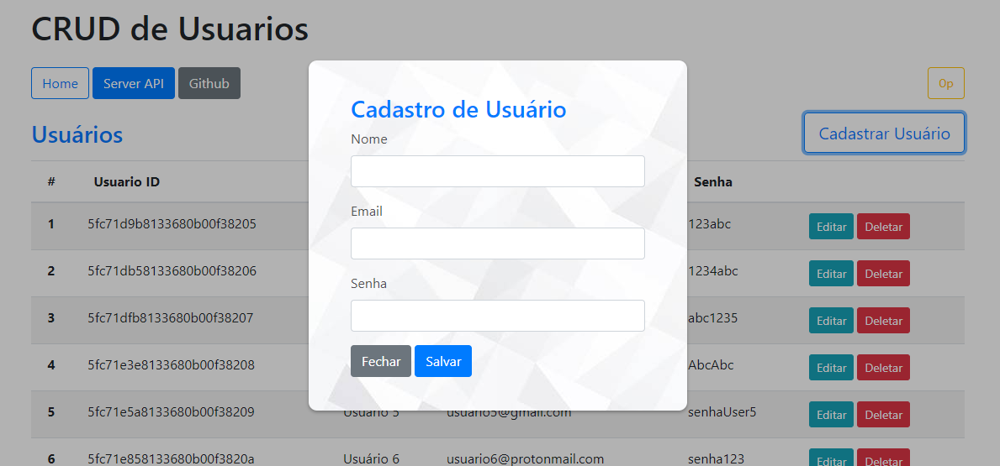
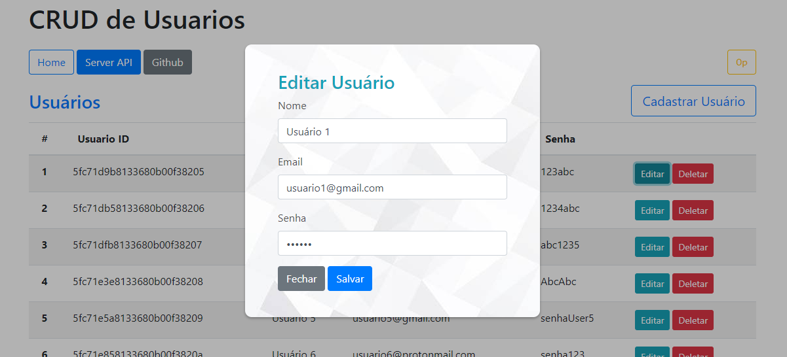

# VUE.JS CRUD

CRUD de usuários utlizando Vue.js no front-end e Node.js com MongoDB no back-end.


<details>
  <summary>Modal <sub><sup>(click here)</sup></sub></summary>
<pre>


</pre>
</details>

## Instalação

Necessário ter instalado o [**MongoDB**](https://www.mongodb.com/try/download/community "**MongoDB**") e [**Node.js**](https://nodejs.org/en/download/ "**Node.js**")

```bash
# Clone o repositório
$ git clone https://github.com/leonardogbxv/vuejs-crud.git
# Entre na pasta do projeto
$ cd vuejs-crud
# Instale as dependências do projeto
$ npm install
# Entre na pasta do front-end
$ cd client
# Instale as dependências do front-end
$ npm install
# Execute o front-end
$ npm run serve
# Volte para a raiz do projeto (vuejs-crud)
$ cd ..
# Execute o back-end
$ npm run dev
```

Agora temos a nossa API do back-end rodando na porta 3000, e o front-end na porta 8080.

## Funcionalidades

- Cadastrar novos usuários com nome, e-mail e senha; **(CREATE)**
- Listar todos os usuários da aplicação em uma tabela na página inicial, tabela essa com as seguintes informações: **(READ)**
  - Usuario ID (ObjectId único do usuário no MongoDB);
  - Nome;
  - E-mail;
  - Senha;
- Editar informações de um usuário já cadastrado; **(UPDATE)**
- Remover um usuário da aplicação; **(DELETE)**

### Funcionamento 

Nesse projeto, é realiza a divisão entre o front-end e back-end, de modo que ambos iniciem em endereços/portas diferentes.

No back-end, é onde temos a nossa API e banco de dados, desenvolvidos em Node.js e MongoDB, rodando na porta 3000. Todas as rotas de *GET*, *POST*, *PUT* e *DELETE* podem ser localizadas no diretório `server>routes>api>users.js`, elas correspondem à rota http `/api/users` da aplicação (http://localhost:3000/api/users). A conexão com o banco de dados é feita no diretório `server>database>db.js`, nesse arquivo também temos as funções do CRUD sendo exportadas para serem usadas nas rotas da API.

O front-end, nosso "client", foi desenvolvido totalmente com Vue.js - framework JavaScript -, este rodando na porta 8080 (http://localhost:8080). O projeto foi construído com o cliente oficial do Vue.js, o Vue CLI, facilitando a configuração e geração da aplicação Vue.js; Opção escolhida por se tratar de um ambiente mais profissional, de acordo com pesquisas, porém a utilização do Vue.js com a inclusão direta da tag `<script>` também foi estudada. 

Essa aplicação Vue, é composta por 4 componentes:

- `<Header />`: Cabeçalho com título e "painel de navegação" da aplicação;
- `<UserRegisterForm />`: Modal com o formulário para cadastro de um novo usuário;
- `<UserEditForm />`: Modal com o formulário para editar e enviar as alterações do usuário;
- `<UsersTable />`: Tabela com toda a listagem dos usuários cadastrados no sistema.

Esses componentes são todos renderizados no `App.vue`, a raiz da aplicação. Ele define o template da nossa página, adicionando os componentes na tag `<template>`.
As requisições, para a API do back-end, são todas feitas usando a própria Fetch API do JavaScript, o CRUD é posto em funcionamento com ela. O *GET* e *DELETE* são realizados no componente `<UsersTable />`, *POST* no modal de cadastro `<UserRegisterForm />`, e a requisição *PUT* é feita no modal de edição `<UserEditForm />`.

O framework Bootstrap, foi usado para fazer a resposividade e estilização de alguns elementos da aplicação. Os modais, de cadastro e edição, foram estilizados com CSS puro.

## Tecnologias

Abaixo estão as tecnologias e depêndencias utilizadas no desenvolvimento do projeto.

- [**Vue.js:**](https://vuejs.org/ "**Vue.js:**") Framework JavaScript Progressivo, usado para desenvolver interfaces de usuário dinâmicas com HMTL, CSS e JS.
- [**Bootstrap:**](https://getbootstrap.com/docs/4.5/getting-started/introduction/ "**Bootstrap:**") Framework front-end com uma grande coleção de códigos CSS, foi usado no projeto para fazer a estilização e responsividade.
- [**Node.js:**](https://nodejs.org/en/docs/ "**Node.js:**") Ambiente JavaScript no lado do servidor, o back-end do projeto foi todo desenvolvido em Node.js.
- [**Express:**](https://github.com/expressjs/express "**Express:**") Framework do Node.js, facilita a criação de aplicações web com configurações de rotas, middlewares e outras funções;
- [**Cors:**](https://www.npmjs.com/package/cors "**Cors:**") Pacote Node.js para habilitar o CORS - "Cross-Origin Resource Sharing" - na aplicação. No caso, requisições para outro domínio - localhost:3000 (nossa API).
- [**MongoDB:**](https://docs.mongodb.com/ "**MongoDB:**") Banco de dados NoSQL utilizado no projeto.
- [**Nodemon:**](https://github.com/remy/nodemon "**Nodemon:**") Usado para auxiliar no desenvolvimento, sempre atualizando a página web quando houver mudanças nos arquivos;

###### :D